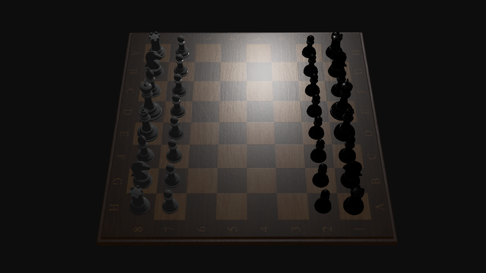

# OpenGL Chessgame
The purpouse of this project is to learn the fundamentals of OpenGL. While learning OpenGL I'm creating a chessgame based on a previous chessgame made in Java. I have followed https://learnopengl.com/ and tried to implement the techniques in my own way to create the chessgame. 

Currently i'm trying to implement reactphysics3d in order to use raycasting for object detection. I have already programmed PBR-shaders but I will also implement image based lighting and shadows. 

